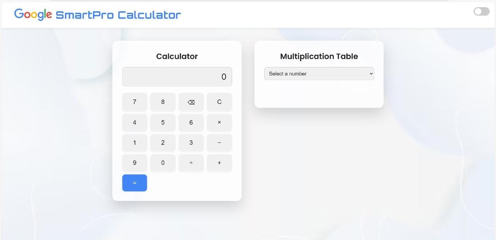
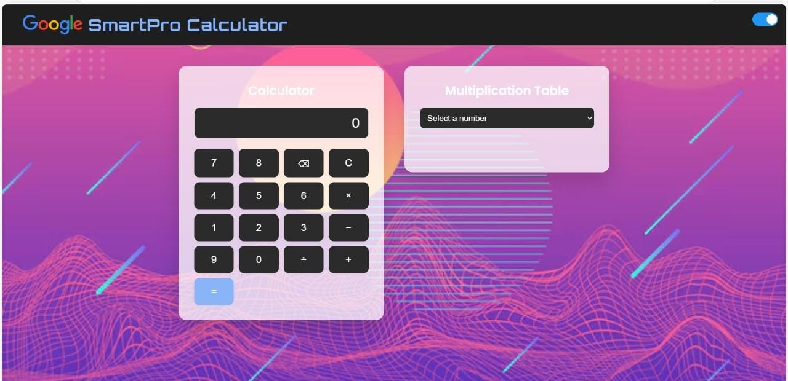

# 🔢 SmartPro Calculator

An advanced and visually appealing calculator app with Dark/Light Mode and Multiplication Table Generator! Built using **HTML, CSS, JavaScript** and enhanced UI with 3D backgrounds.

---

## 🌐 Live Demo

✨ Try it live here:  
🔗 [SmartPro Calculator Live](https://peruguadithya.github.io/SmartPro-calculator/)

---

## 📸 Light & Dark Mode Previews

| Light Mode | Dark Mode |
|------------|-----------|
|  |  |

---

## 🚀 Features

- ✅ 3D Styled Calculator UI
- 🌙 Dark/Light Mode Toggle
- ✖️ All Arithmetic Operations
- 🔢 Dynamic Multiplication Table
- 🎨 Stylish 3D Backgrounds
- 📱 Fully Responsive Layout

---

## 🛠️ Built With

- HTML5  
- CSS3  
- JavaScript  
- Google Fonts  
- Freepik 3D Backgrounds

---

## 🤝 Contributing

💡 Contributions, suggestions, and bug reports are welcome!  
Check the [Issues page](https://github.com/PERUGUADITHYA/SmartPro-Calculator/issues) to get started.

---

## 🌐 Connect With Me

- 💼 [LinkedIn](https://www.linkedin.com/in/peruguadithya)
- 🐙 [GitHub](https://github.com/PERUGUADITHYA)

---

## 📜 License

Distributed under the MIT License.  
See `LICENSE` for more information.

---

## 🙌 Support

If you liked this project, please ⭐ the repository and share it with others!  
Thank you for visiting!

